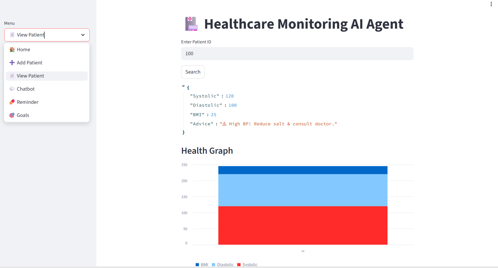
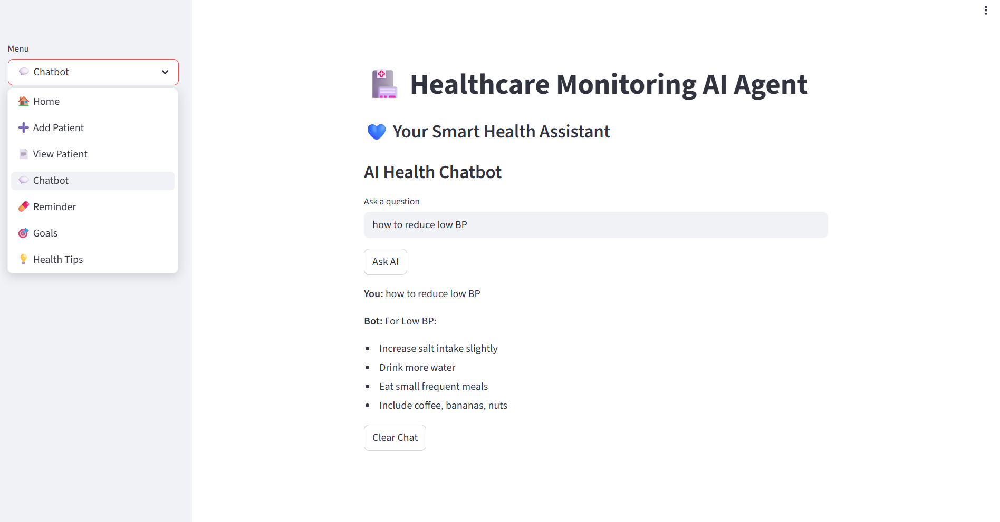

# 🏥 Healthcare Monitoring AI Agent

AI-powered Healthcare Monitoring System with chatbot, visualization, report generation, and health analysis.

---

## 📌 Project Overview
This project helps users monitor health parameters like BP and BMI, provides health advice, chatbot interaction, and more.

## 🚀 Features

- 🩺 Patient health data monitoring (BP, BMI)
- 📊 Automated health advice system
- 🤖 AI chatbot for health-related queries
- 💬 Chat history tracking
- 💊 Medication reminder system
- 🌐 Deployed web application using Streamlit

- ## 🧠 How It Works

1. User enters health data (BP, BMI)
2. System analyzes and gives advice
3. User can ask questions via chatbot
4. User sets medication reminders

5. ## ▶️ Run the App

streamlit run app.py

## 🌐 Live App

https://healthcare-ai-agent-mvgyyrsoqfgxz3muhxxcfc.streamlit.app/

--

In Week 3, the project was enhanced into a **multi-functional healthcare monitoring assistant** with additional features and improved functionality.

### 🔹 New Features Added

- 📊 **Health Data Visualization**
  - Displayed BP trends using charts

- 📋 **Health Report Generator**
  - Generates patient report with BP, BMI, and advice

- 🤖 **Improved AI Chatbot**
  - Handles multiple health queries like diet, BP causes, exercise

- ⚠ **Medication Interaction Checker**
  - Detects unsafe combinations (e.g., paracetamol + alcohol)

- 🎯 **Health Goal Tracking**
  - Allows users to set and monitor target weight

- 📁 **Data Handling Improvements**
  - Structured patient data storage and display

---

### 🎯 Outcome

The system now provides an **end-to-end healthcare monitoring workflow**, including:
- Data input
- Health analysis
- Advice generation
- Visualization
- Patient interaction

---

### 📌 Learning Highlights

- Implemented data visualization using pandas  
- Improved rule-based chatbot logic  
- Added user-friendly healthcare features  
- Handled real-time user inputs and session data

 ## 📅 Week 4 Update

In Week 4, we upgraded our project into a Streamlit-based web application.

New features added:
- Interactive UI using Streamlit
- Health data visualization (graphs)
- Health report generation
- CSV export functionality
- Chatbot for health queries
- Medication reminder system
- Goal tracking feature

- ## 📸 Output Screenshot

## 📅 Week 5 Update

In Week 5, we enhanced the Healthcare Monitoring AI Agent by improving system intelligence and user experience.

New features added:
- Improved chatbot with condition-based responses
- Chat history using session state
- Health risk analysis feature
- Fixed report generation system
- CSV download functionality
- Health tips section
- UI enhancements

- ## 📸 Week 5 Output

